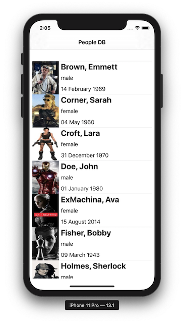
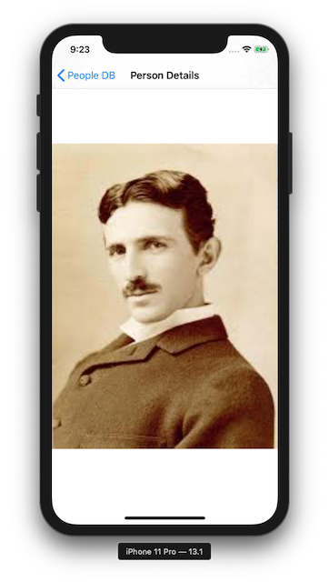

# ME iOS Code Challenge

## Introduction

The goal of this code challenge is to allow us to evaluate your software development and problem solving skills.

Please deliver a solution that meets requirements below.

We are looking for pragmatic, maintainable, easy to read code, as well as tests that proves that your code works.

Feel free to use 3rd party libraries as you see fit to support the design of your solution. In particular, these are some of the features we would like to see:

-   Demonstrate knowlege in Swift programming language
-   Demonstrate knowlege in development tools and processes, for example

    -   Xcode
    -   Interface Builder
    -   SwiftUI

-   Demonstrate integration ability with re-usable components, for example:

    -   Quick/Nimble
    -   AlamoFire
    -   SwiftyJSON
    -   etc

-   Test Driven Development (TDD) or Behaviour Drive Development (BDD)

-   Code documentation

-   Interface with Rest API

## Time & Effort

This code challenge should require not more than 3 - 4 hours to complete.

## The Problem

You are required to implement iOS application that interfaces to REST api server to display employees details.

### Example Data

#### Employees List

```
[
    {
        "id": 1,
        "first_name": "John",
        "last_name": "Doe",
        "gender": "male",
        "birth_date": "01 January 1980",
        "thumbImage": "\"/9j/4AAQSkZJRgABAQAAAQABAAD/2wBDAAIBAQEBAQIBAQECAgICAgQDAgICAgUEBAMEBgUGBgYFBgYGBwkIBgcJBwYGCAsICQoKCgoKBggLDAsKDAkKCgr/2wBDAQICAgICAgUDAwUKBwYHCgoKCgoKCgoKCgoKCgoKCgoKCgoKCgoKCgoKCgoKCgoKCgoKCgoKCgoKCgoKCgoKCgr/...""
    },
    {
        "id": 2,
        "first_name": "Emmett",
        "last_name": "Brown",
        "gender": "male",
        "birth_date": "14 February 1969",
        "thumbImage": "..."
    },
    ...
]
```

### Employee Details

```
{
    "id": 1,
    "first_name": "John",
    "last_name": "Doe",
    "gender": "male",
    "birth_date": "01 January 1980",
    "thumbImage": "...",
    "image": "..."
}

```

### The Application

-   Implement _native_ iOS application of your choices (using Swift and Xcode)
-   Application should consume JSON data from a server running locally on your machine (see Employees RAML specification below)
-   Application should provide a screen that shows the list of employees (see sample screens below)
-   Application should provde a screen that shows details (i.e. includes full image) of a selected employee
-   Setup a public repository (i.e. Github repository)
-   Put Xcode project on your Git public repository
-   Send us a link to your git repository

#### Employee List Screen



#### Employee Details Screen



## Installing Code Challenge

-   Unzip ME-ios-challenge.zip

```
├── README.md
├── clients/
│   └── ios/
├── people.raml
├── res/
│   └── images/
└── servers/
    └── people/
        ├── images/
        └── ppl_server.py
```

-   Install 'pip' Python package management

```
$ brew install pip
```

-   Install python packages for People server

```
$ pip install request
$ pip install flask
$ pip install flask-restful
$ pip install opencv-python
```

### Running People Server

```
$ cd $ME_CHALLENGE/servers/people
$ python3 ppl_server.py

```

You should see output as follow:

```
* Serving Flask app "ppl_server" (lazy loading)
 * Environment: development
 * Debug mode: on
 * Running on http://0.0.0.0:5000/ (Press CTRL+C to quit)
 * Restarting with stat
 * Debugger is active!
 * Debugger PIN: 123-168-005
```

Checking server's status

```
$ curl http://127.0.0.1:5000/healthCheck
"Ok"
```

Retrieve employee's details.

```
$ curl http://127.0.0.1:5000/employees/1

{
    "id": 1,
    "first_name": "John",
    "last_name": "Doe",
    "gender": "male",
    "birth_date": "01 January 1980",
    "thumbImage": "...",
    "image": "/9j/4AAQSkZJRgABAgEAZABkAAD/4RssRXhpZgAATU0AKgAAAAgABwESAAMAAAABAAEAAAEaAAUA\nAAABAAAAYgEbAAUAAAABAAAAagEoAAMAAAABAAIAAAExAAIAAAAcAAAAcgEyAAIAAAAUAAAAjodp\nAAQAAAABAAAApAAAANAAD0JAAAAnEAAPQkAAACcQQWRvYmUgUGhvdG9zaG9wIENTMyBXaW5kb3dz
    ..."
}
```

### Employees API RAML

```
#%RAML 1.0
title: Employees API
mediaType: application/json
baseUri: http://127.0.0.1:5000
version: 1.0
types:
    Employee: |
        {
            "properties": {
                "id": {
                    "type": "number",
                    "required": true
                },
                "first_name": {
                    "type": "string",
                    "required": true
                },
                "last_name": {
                    "type": "string",
                    "required": true
                },
                "gender": {
                    "type": "string",
                    "required": true
                },
                "birth_date": {
                    "type": "string",
                    "required": true
                },
                "thumbImage": {
                    "type": "string", # Base64 (UTF-8) encoded string
                    "required": false
                },
                "image": {
                    "type": "string", # Base64 (UTF-8) encoded string
                    "required": false
                },
            }
        }

/healthCheck:
    get:
        responses:
            200:
                application/json:
                    type: object
                    properties:
                        message: string
                    example:
                        message: "Ok"

/employees:
    get:
        responses:
            200:
                body:
                    properties:
                        people: Employee[]
    /{id}:
        get:
            responses:
                200:
                    body:
                        properties:
                            Employee
                404:
                    body:
                        properties:
                            message: string
                        example:
                            message: "Not found"

```
